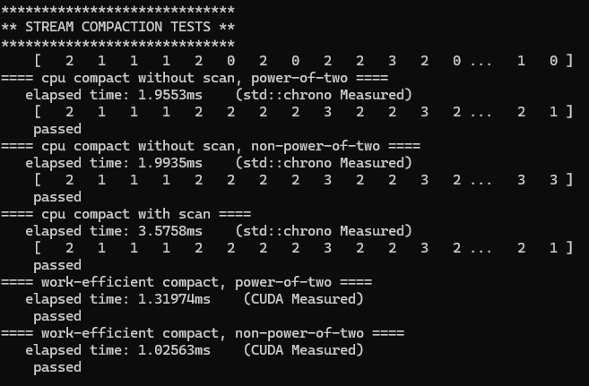
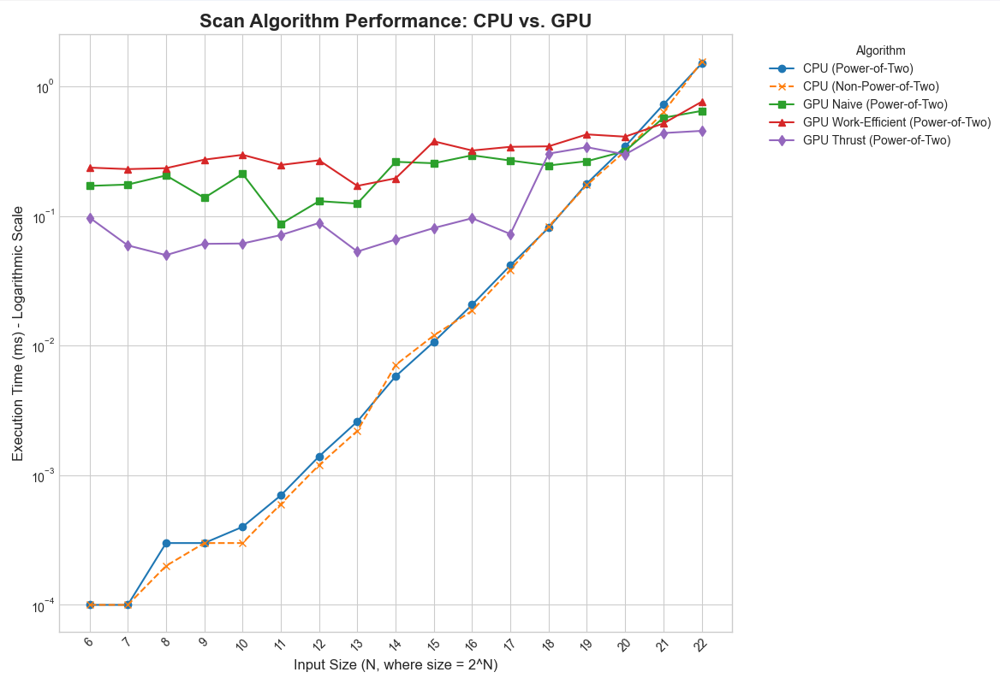

CUDA Stream Compaction
======================

**University of Pennsylvania, CIS 565: GPU Programming and Architecture, Project 2**



  * Xiaonan Pan
    * [LinkedIn](https://www.linkedin.com/in/xiaonan-pan-9b0b0b1a7), [My Blog](www.tsingloo.com), [GitHub](https://github.com/TsingLoo)
  * Tested on: 
    * Windows 11 24H2
    * 13600KF @ 3.5Ghz
    * 4070 SUPER 12GB
    * 32GB RAM

# Overview

This project provides thoroughly tested CPU and GPU (CUDA) implementations of parallel **scan** (exclusive and inclusive) and **stream compaction** algorithms. Additionally, a CUDA-based **radix sort** is implemented and tested. The CUDA scan implementation specifically explores and contrasts both naive and work-efficient approaches.


# Implementation

Most of the GPU scan implementations for this project were based on the pseudocode provided in the lecture slides. Throughout the coding process, I found the mental transition between the serial "scheduler's view" and the parallel "thread's view" to be a fresh and critical challenge. For example, the work-efficient up-sweep algorithm is presented from a high-level, scheduler's perspective:

```cpp
for d = 0 to log_2{n} - 1
  for all k = 0 to n – 1 by 2^(d+1) in parallel
    x[k + 2^(d+1) – 1] += x[k + 2^(d) – 1];
```

However, in a massively parallel CUDA kernel, there is no such central scheduler. Instead, thousands of threads awaken simultaneously, each with its own dense, unique ID `k`. The core of the implementation is to translate the high-level plan into an independent action for each thread. This is achieved with a filter condition. Once a thread passes a check like `if ((k + 1) % fullStride == 0)`, it has successfully identified itself as one of the active workers from the scheduler's plan. At that moment, the thread's own dense ID `k` becomes the actual memory address for the write operation, as shown in the kernel:
```cpp
__global__ void kernWorkEfficientUpSweep(int paddedN, int n, int d, int* idata) {
    int k = blockIdx.x * blockDim.x + threadIdx.x;

    int halfStride = 1 << (d);
    int fullStride = halfStride * 2;

    if (k >= n || ((k + 1) % fullStride != 0)) {
        return;
    }

    // up-sweep
    idata[k] += idata[k - halfStride];
}
```

Although further optimizations involve launching a compacted grid where each thread must explicitly calculate its target address, I still find this fundamental transition from a collective plan to individual, self-aware threads to be the most impressive aspect of parallel programming. This is the optimized version:
```cpp
__global__ void kernUpSweep(int n, int d, int* data) {
    // k is the ID of the k-th active thread (dense)
    int k = blockIdx.x * blockDim.x + threadIdx.x;

    int fullStride = 1 << (d + 1);
    int halfStride = 1 << d;

    int global_idx = (k + 1) * fullStride - 1;

    if (global_idx >= n) {
        return;
    }

    data[global_idx] += data[global_idx - halfStride];
}
```

# Performance Analysis



The x-axis is the input size(N, where size = 2^N)

The y-axis is the execution time (ms), the less the better

## Explanation 

**The Crossover Point:** For small input sizes (roughly N < 20), the **CPU is significantly faster**. After this point, the GPU implementations become equal and faster than the CPU. The low performance of my work-efficient GPU implementation was due to excessive IO between the host and device. To reuse the `scan` function, intermediate results were copied from the device to the host, and the output of the scan was then copied back to the device. This data "round trip" is a significant performance bottleneck. To avoid this, the code was refactored to create a device side helper that operates exclusively on device pointers, without these time-consuming data transfers.

# Extra Credit

I implemented the Radix Sort and add the tests for it. In`main.cpp` it is called by

```cpp
int *a = new int[SIZE];
int *c = new int[SIZE];

//a is the input data, c is the output data
StreamCompaction::Radix::sort(SIZE, c, a);
```

```cpp
printf("\n");
printf("*****************************\n");
printf("** RADIX TESTS **\n");
printf("*****************************\n");

genArray(SIZE, a, 1000); // Generate a new array with a larger range of numbers
printArray(SIZE, a, true);

memcpy(b, a, SIZE * sizeof(int)); // Copy a into b
printDesc("cpu sort (std::sort), power-of-two");
auto start_time = std::chrono::high_resolution_clock::now();
std::sort(b, b + SIZE); // Sort b to create the correct reference answer
auto end_time = std::chrono::high_resolution_clock::now();
std::chrono::duration<double, std::milli> elapsed = end_time - start_time;
printf("    elapsed time: %.4fms    (std::chrono Measured)\n", elapsed.count());
printArray(SIZE, b, true);

zeroArray(SIZE, c);
printDesc("radix sort, power-of-two");
StreamCompaction::Radix::sort(SIZE, c, a);
printElapsedTime(StreamCompaction::Radix::timer().getGpuElapsedTimeForPreviousOperation(), "(CUDA Measured)");
printCmpResult(SIZE, b, c);

memcpy(b, a, NPOT * sizeof(int));
std::sort(b, b + NPOT);


zeroArray(SIZE, c);
printDesc("radix sort, non-power-of-two");
StreamCompaction::Radix::sort(NPOT, c, a);
printElapsedTime(StreamCompaction::Radix::timer().getGpuElapsedTimeForPreviousOperation(), "(CUDA Measured)");
printCmpResult(NPOT, b, c);
```


# Test Output

`#define BLOCK_SIZE 256`,`const int SIZE = 1 << 10;`


```cpp
****************
** SCAN TESTS **
****************
    [  45  35  35   0   7  15  46  20  46  47  42   7  18 ...  22   0 ]
==== cpu scan, power-of-two ====
   elapsed time: 0.0007ms    (std::chrono Measured)
    [   0  45  80 115 115 122 137 183 203 249 296 338 345 ... 24413 24435 ]
==== cpu scan, non-power-of-two ====
   elapsed time: 0.0006ms    (std::chrono Measured)
    [   0  45  80 115 115 122 137 183 203 249 296 338 345 ... 24328 24355 ]
    passed
==== naive scan, power-of-two ====
   elapsed time: 0.238592ms    (CUDA Measured)
    passed
==== naive scan, non-power-of-two ====
   elapsed time: 0.055296ms    (CUDA Measured)
    passed
==== work-efficient scan, power-of-two ====
   elapsed time: 0.250784ms    (CUDA Measured)
    passed
==== work-efficient scan, non-power-of-two ====
   elapsed time: 0.11776ms    (CUDA Measured)
    passed
==== thrust scan, power-of-two ====
   elapsed time: 0.08192ms    (CUDA Measured)
    passed
==== thrust scan, non-power-of-two ====
   elapsed time: 0.03072ms    (CUDA Measured)
    passed

*****************************
** STREAM COMPACTION TESTS **
*****************************
    [   3   3   3   0   1   1   0   0   0   3   2   3   2 ...   2   0 ]
==== cpu compact without scan, power-of-two ====
   elapsed time: 0.0022ms    (std::chrono Measured)
    [   3   3   3   1   1   3   2   3   2   2   3   3   2 ...   2   2 ]
    passed
==== cpu compact without scan, non-power-of-two ====
   elapsed time: 0.0011ms    (std::chrono Measured)
    [   3   3   3   1   1   3   2   3   2   2   3   3   2 ...   1   2 ]
    passed
==== cpu compact with scan ====
   elapsed time: 0.0055ms    (std::chrono Measured)
    [   3   3   3   1   1   3   2   3   2   2   3   3   2 ...   2   2 ]
    passed
==== work-efficient compact, power-of-two ====
   elapsed time: 0.284672ms    (CUDA Measured)
    passed
==== work-efficient compact, non-power-of-two ====
   elapsed time: 0.1536ms    (CUDA Measured)
    passed

*****************************
** RADIX TESTS **
*****************************
    [ 795 735 835   0  57 565 396 420 196 647  42   7 118 ... 122 648 ]
==== cpu sort (std::sort), power-of-two ====
    elapsed time: 0.0299ms    (std::chrono Measured)
    [   0   2   2   2   3   5   5   6   6   6   7   8   8 ... 993 994 ]
==== radix sort, power-of-two ====
   elapsed time: 5.88186ms    (CUDA Measured)
    passed
==== radix sort, non-power-of-two ====
   elapsed time: 5.72314ms    (CUDA Measured)
    passed
Press any key to continue . . .
```

